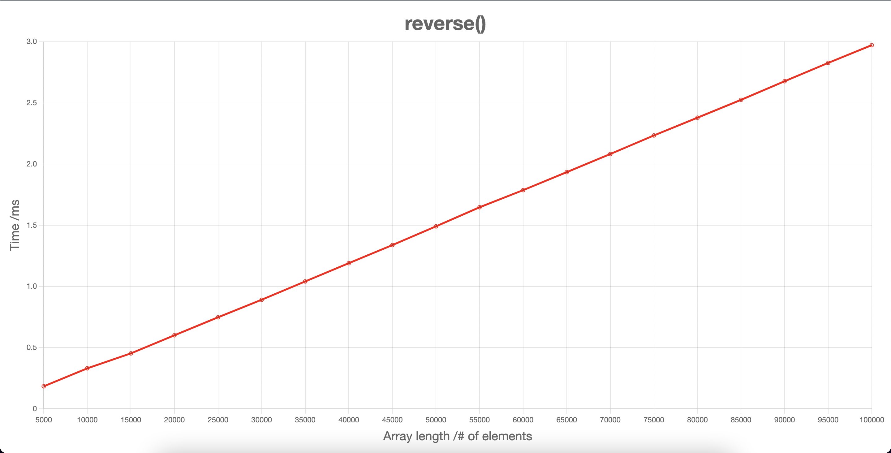
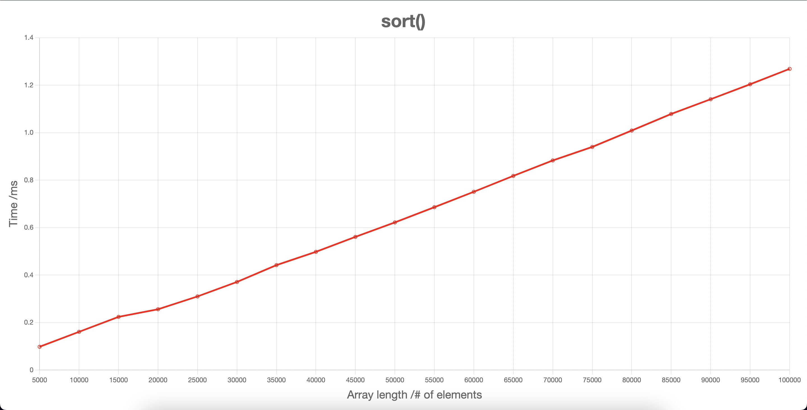
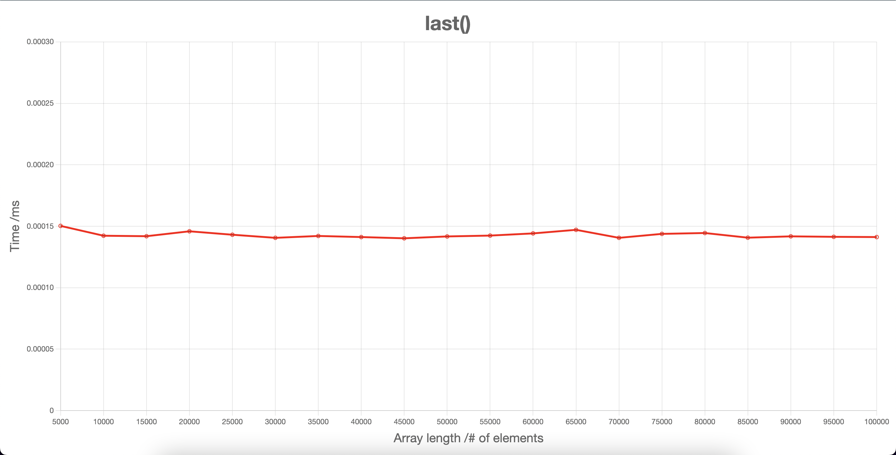
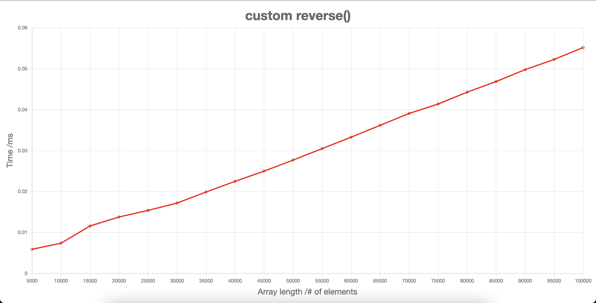
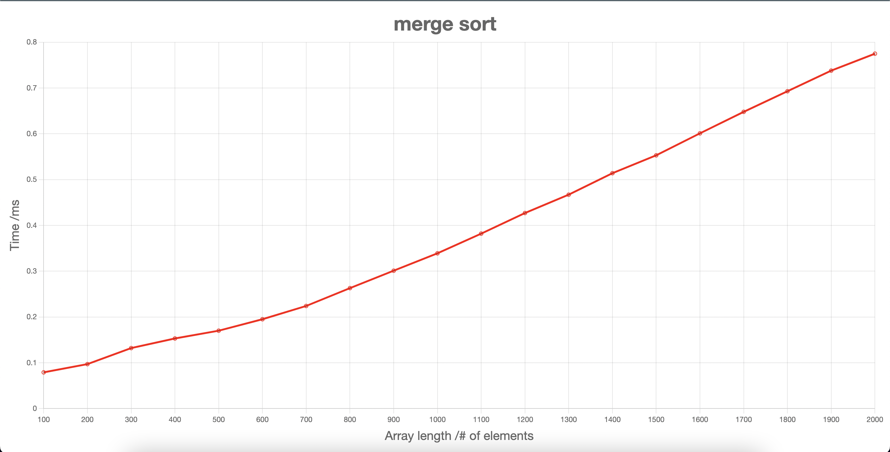
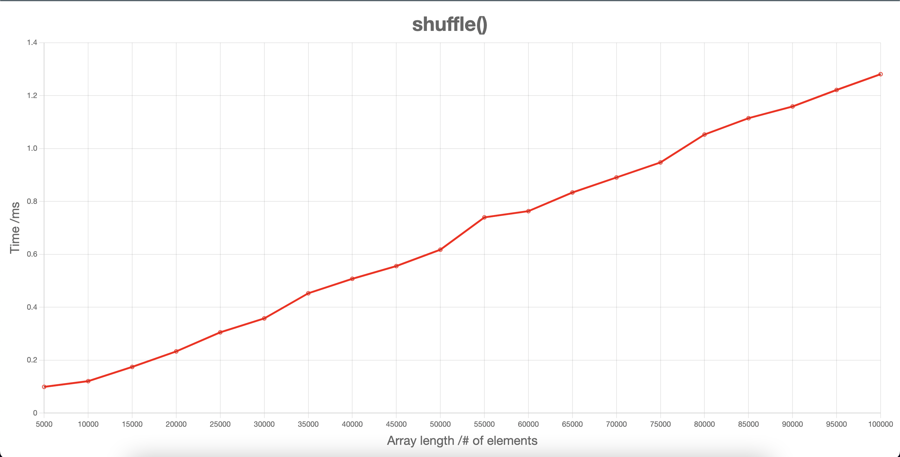
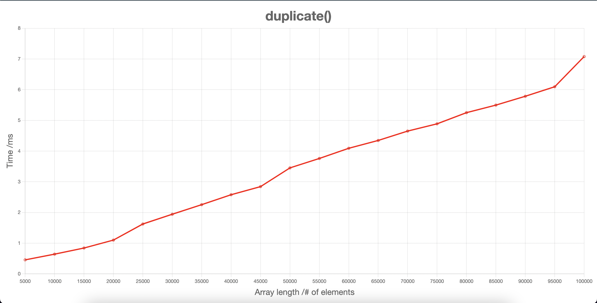
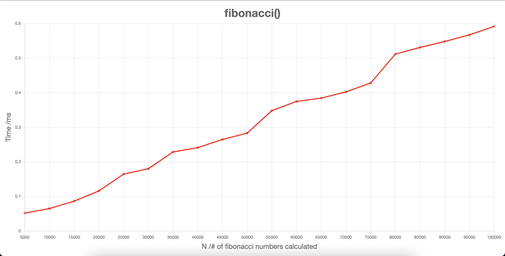
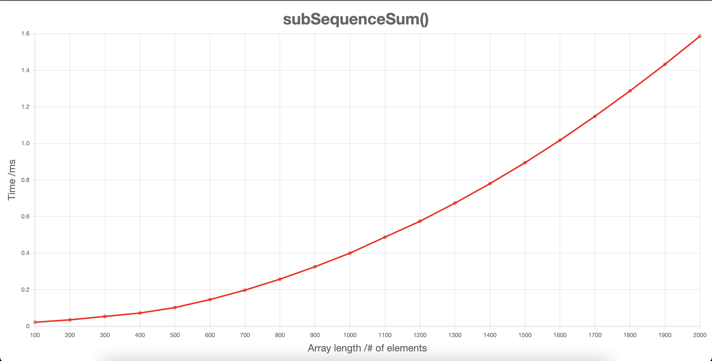

# Algorithmic Complexity

This project contains a timing framework for measuring the efficiency of algorithms. This timing framework has been applied on in built JS functions and on custom built JS functions I've made myself to test my skills of algorithm desgin.

Each custom built function comes with its own feature test, unit test, JS file for plotting data using Chart.js and a HTML file for displaying the plotted graph. A package.json has also been made for each function in order to use esbuild to generate a script that is passed into the HTML file.

There are a number of helper functions that generate all the necessary data by passing the relevant function in as a callback:

- `generateArray(length)`
  - Creates an array which has a length equal to the parameter passed in
  - This function is called to create huge arrays which are passed into each function to test the time complexity
- `createDataPoint(input, callback, numberOfMeasurements, target)`
  - Takes an average of `numberOfMeasurements` measurements of the time taken for `callback` to act on `input`
  - Time is measured by using `performance.now()`
  - `target` is another parameter which is exclusively used for `subSequenceSum()`
- `saveData(callbackOne, num)`
  - Calls `generateArray` and `createDataPoint()` 20 times to create an array of data points for timing `callbackOne`, ready to be plotted on a graph

#### Custom Functions

- [`last(array)`](https://github.com/jmcnally17/algorithmic-complexity/blob/main/custom-algorithms/last/last.js)
  - returns the last element from the array passed in
- [`reverse(array)`](https://github.com/jmcnally17/algorithmic-complexity/blob/main/custom-algorithms/reverse/reverse.js)
  - reverses the order of the array passed in and returns the updated array
- [`sort(array)`](https://github.com/jmcnally17/algorithmic-complexity/blob/main/custom-algorithms/sort/sort.js)
  - mutatest the array passed in into ascending order and returns it
- [`shuffle(array)`](https://github.com/jmcnally17/algorithmic-complexity/blob/main/custom-algorithms/shuffle/shuffle.js)
  - returns a new array which contains all the elements of the original in a random order
- [`duplicate(array)`](https://github.com/jmcnally17/algorithmic-complexity/blob/main/custom-algorithms/duplicate/duplicate.js)
  - returns an array containing the elements that appeared more than once in the original array passed in
- [`fibonacci(n)`](https://github.com/jmcnally17/algorithmic-complexity/blob/main/custom-algorithms/fibonacci/fibonacci.js)
  - returns an array containing the first n-terms in the fibonacci sequence
- [`subSequenceSum(array, target)`](https://github.com/jmcnally17/algorithmic-complexity/blob/main/custom-algorithms/sub-sequence-sum/subSequenceSum.js)
  - returns true if a sub-sequence in the array passed in sums up to the target

_Note: Due to a couple of slight differences in the input required for each custom function, `fibonacci()` has its own function to save its data and `sort()` has its own function to create a single data point_

## Getting Started

This program is run using Node.js, which is installed using NVM - Node Version Manager. So, if you haven't already, install NVM using:

```
curl -o- https://raw.githubusercontent.com/nvm-sh/nvm/v0.39.1/install.sh | bash
```

Now, your ~/.zshrc file will need reloading:

```
source ~/.zshrc
```

Next, you can install and start using node by running:

```
nvm install node
nvm use node
```

`nvm use node` will use the latest stable version. Once that is set up, you can now clone this repository and then install the necessary dependencies using:

```
git clone https://github.com/jmcnally17/bank-tech-test.git
npm install
```

`npm install` must be run while in the main directory.

Now you are all set up. Move onto the following section to learn how to use this program.

## How To Use

The graphs for each timed funtion can be found below. However, if you wish to run the program yourself, navigate to the folder of the function you wish to time and run `npm run build`. Then, in the same folder, open the corresponding HTML file to plot the data and view the graph in your browser. E.g. for `reverse()`, navigate to the [reverse folder](https://github.com/jmcnally17/algorithmic-complexity/tree/main/custom-algorithms/reverse) and run:

```
npm run build
open reverse.html
```

## Graphs

### In Built JS Functions

#### reverse()

O(n)



#### sort()

O(n)



### Custom JS Functions

#### last()

O(1)



#### reverse()

O(n)



#### sort()

O(n log n)



#### shuffle()

Should be O(n) but difficult to tell from this graph



#### duplicate()

O(n)



#### fibonacci()

Looks like O(n) but slight uncertainty with the fluctuations



#### subSequenceSum()

O(n<sup>2</sup>)



## Testing

The Test-Driven Development (TDD) process was followed for creating every function in this project, with Jest being used as the testing framework. In order to run these tests, while in the main directory, simply run `npm test`. The test coverage can also be viewed by running `npm run test:coverage`.

## Issues
